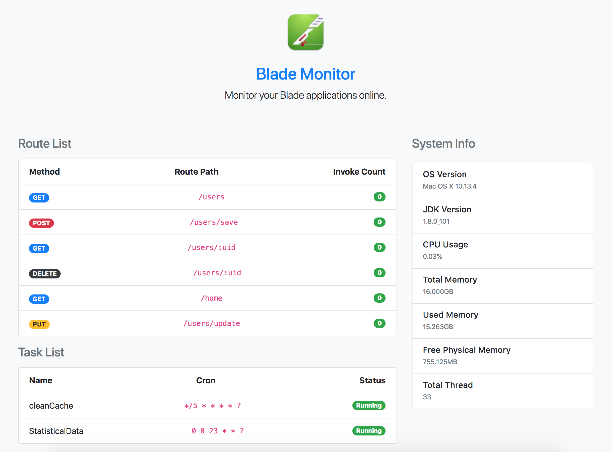

# Blade Monitor

Monitor the Blade application.

## Preview



## Usage

- `blade-mvc:2.0.8-BETA2` or later

Adding dependency

```xml
<dependency>
    <groupId>com.bladejava</groupId>
    <artifactId>blade-monitor</artifactId>
    <version>0.0.1-SNAPSHOT</version>
</dependency>
```

Access `http://HOST:PORT/monitor`

# License

[Apache2](LICENSE)